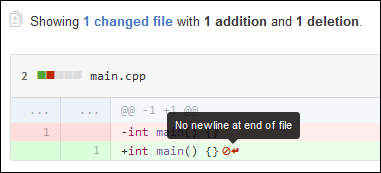

# linelint


[](https://cloud.drone.io/fernandrone/linelint)
[](https://goreportcard.com/report/github.com/fernandrone/linelint)

A linter that validates simple *newline* and *whitespace* rules in all sorts of files. It can:

- Recursively check a directory tree for files that do not end in a newline
- Automatically fix these files by adding a newline or trimming extra newlines

Very useful in avoiding these warnings from GitHub 👇

<p align="center">
  
</p>

## Install

Check the **[Releases](https://github.com/fernandrone/linelint/releases)** page for the latest version for your platform.

Alternatively, use `go get` to build from HEAD (might be unstable).

```console
go get github.com/fernandrone/linelint
```

See the **[#GitHub Actions](#GitHub-Actions)** and the **[#Docker](#Docker)** for their respective setup instructions.

## Usage

> This is a project in development. Use it at your own risk!

Executing the binary will automatically search the local directory tree for linting errors.

```console
$ linelint .
[EOF Rule] File "LICENSE" has lint errors
[EOF Rule] File "linter/eof.go" has lint errors

Total of 2 lint errors!
```

Pass a list of files or directories to limit your search.

```console
$ linelint README.md LICENSE linter/config.go
[EOF Rule] File "LICENSE" has lint errors

Total of 1 lint errors!
```

After checking all files, in case any rule has failed, Linelint will finish with an error (exit code 1).

### AutoFix

If the `autofix` option is set to `true` (it is `false` by default, activate it with the `-a` flag or set it in the configuration file), Linelint will attempt to fix any linting error by rewriting the file.

```console
$ linelint -a .
[EOF Rule] File "LICENSE" has lint errors
[EOF Rule] File "LICENSE" lint errors fixed
[EOF Rule] File "linter/eof.go" has lint errors
[EOF Rule] File "linter/eof.go" lint errors fixed
```

If all files are fixed successfully, Linelint terminates with exit code 0.

### Stdin

Pass "-" as an argument to read data from standard input instead of a list of files.

```console
$ cat hello.txt
Hello World


```

```console
$ cat hello.txt | linelint -
Hello World
```

When reading from stdin, linelint behavior changes and it won't report lint errors. Instead when autofix is on, it will fix them and output the result to `/dev/stdout`. When autofix is off, it will terminate the program with an error code in case there are any linting violations, but won't output anything.

### Help

At any time run `linenlint --help` for a list of available command line arguments.

## Configuration

Create a `.linelint.yml` file in the same working directory you run `linelint` to adjust your settings. See [.linelint.yml](.linelint.yml) for an up-to-date example.

## Rules

Right now it supports only a single rule, "End of File", which is enabled by default.

### EndOfFile

The *End of File* rule checks if the file ends in a newline character, or `\n`. You may find it useful if you dislike seeing these 🚫 symbols at the end of files on GitHub Pull Requests.

By default it also checks if it strictly ends in a single newline character. This behavior can be disabled by setting the `single-new-line` parameter to `false`.

```yaml
rules:
  # checks if file ends in a newline character
  end-of-file:
    # set to true to enable this rule
    enable: true

    # set to true to disable autofix (if enabled globally)
    disable-autofix: false

    # will be ignored only by this rule
    ignore:
      - README.md

    # if true also checks if file ends in a single newline character
    single-new-line: true
```

## GitHub Actions

This project is available at the [GitHub Actions Marketplace](https://github.com/marketplace/actions/linelint).

Create a workflow file at your repository's Workflow folder, like `.github/workflows/lint.yml` (see [lint.yml](.github/workflows/lint.yml) for an updated example):

```yaml
# .github/workflows/main.yml
on: [push]
name: lint

jobs:
  linelint:
    runs-on: ubuntu-latest
    name: Check if all files end in newline
    steps:
      - name: Checkout
        uses: actions/checkout@v2
      - name: Linelint
        uses: actions/linelint@master
        id: linelint
```

This will trigger a validation of all your files. Configure it using a `.linelint.yml` file at the root of your repository. See [#Configuration](#Configuration) for more information.

## Docker

Public Docker images exist at [docker.io/fernandrone/linelint](https://hub.docker.com/repository/docker/fernandrone/linelint). To use it, share any files or directories you want linted with the container's `/data` directory.

```console
docker run -it -v $(pwd):/data fernandrone/linelint
```

To add a configuration file, share it with the root volume of the container:

```console
docker run -it -v $(pwd)/.linelint.yml:/.linelint.yml -v $(pwd):/data fernandrone/linelint
```
